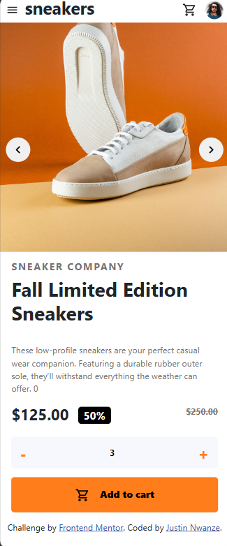

# Frontend Mentor - E-commerce product page solution

This is a solution to the [E-commerce product page challenge on Frontend Mentor](https://www.frontendmentor.io/challenges/ecommerce-product-page-UPsZ9MJp6). Frontend Mentor challenges help you improve your coding skills by building realistic projects.

## Table of contents

- [Overview](#overview)
  - [The challenge](#the-challenge)
  - [Screenshot](#screenshot)
  - [Links](#links)
- [My process](#my-process)
  - [Built with](#built-with)
  - [What I learned](#what-i-learned)
  - [Continued development](#continued-development)
  - [Useful resources](#useful-resources)
- [Author](#author)
- [Acknowledgments](#acknowledgments)

## Overview

### The challenge

Users should be able to:

- View the optimal layout for the site depending on their device's screen size
- See hover states for all interactive elements on the page
- Open a lightbox gallery by clicking on the large product image
- Switch the large product image by clicking on the small thumbnail images
- Add items to the cart
- View the cart and remove items from it

### Screenshot

## Mobile



## Desktop


### Links

- Solution URL: [Github](https://github.com/iamprincetj/ecommerce-product-page-main)
- Live Site URL: [ptj-ecommerce-product](https://ptj-ecommerce-product.netlify.app/)

## My process

### Built with

- Semantic HTML5 markup
- CSS custom properties
- Flexbox
- CSS Grid
- Mobile-first workflow
- [React](https://reactjs.org/) - JS library

# React + Vite

This template provides a minimal setup to get React working in Vite with HMR and some ESLint rules.

Currently, two official plugins are available:

- [@vitejs/plugin-react](https://github.com/vitejs/vite-plugin-react/blob/main/packages/plugin-react/README.md) uses [Babel](https://babeljs.io/) for Fast Refresh
- [@vitejs/plugin-react-swc](https://github.com/vitejs/vite-plugin-react-swc) uses [SWC](https://swc.rs/) for Fast Refresh

### What I learned

I learnt a very useful react way of making my own carousel which was interesting. Making images change on clicking the next or prev arrow.
Also learnt how using useRef in react is very useful for referencing an element in react

To see how you can add code snippets, see below:

```html
<button type="button" className="btn" disabled></button>
```

```css
/** for styling disabled element */
.btn:disabled {
  cursor: not-allowed;
}
```

```js
import { useRef } from 'react';

const headerRef = useRef(null)

console.log(headerRef.current) // logs the h1 to console

<h1 ref={headerRef}>Some HTML code I'm proud of</h1>
```

### Continued development

I want to cotinue with working with frontend and getting better and better with CSS mostly.

### Useful resources

## Author

- Website - [Add your name here](https://www.your-site.com)
- Frontend Mentor - [@iamprincetj](https://www.frontendmentor.io/profile/iamprincetj)
- Twitter - [@Iam_princetj](https://x.com/Iam_princetj)
